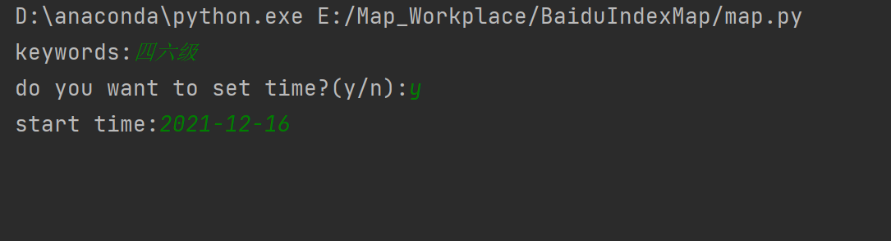
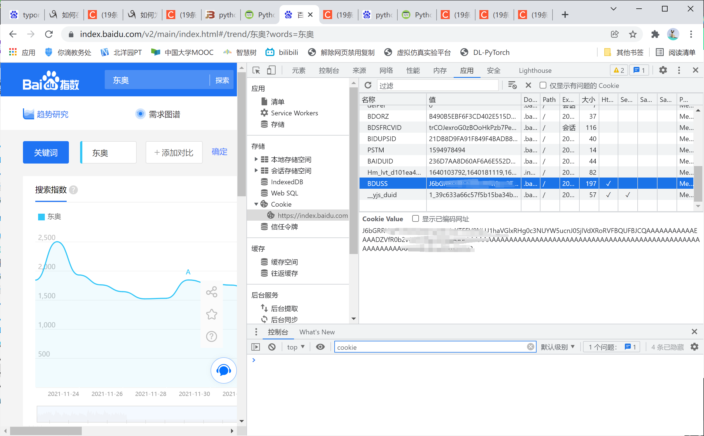
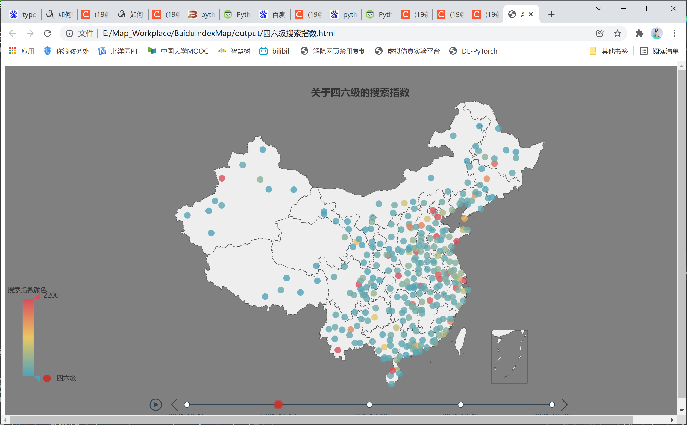
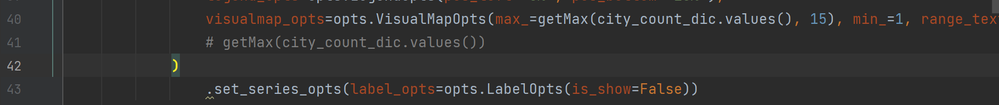

**基于百度搜索指数生成的可视化地图说明文档**

# 程序说明

该程序是基于百度搜索指数生成的可视化地图。地图部分基于pyecharts制作。程序可以根据用户所提供的关键词（当然这个词必须可以被百度指数搜索到）爬下全国各省市（为了美观和运行时间考虑，有小部分删减）的搜索指数，并且将其用pyecharts的geo展示。

运行程序后，首先提示输入keywords：这个时候输入你想搜索的指数。之后询问你是否需要设置开始时间。百度指数可以设置时间区间，如果选择y，之后会提示设置百度指数搜索的起始时间。该程序将爬取自该时间起共五天的数据。

如果选择不设置开始时间，程序将自动搜索近五天的数据。

如果选择设置开始时间，一定要设置在至少五天之前。

程序所能搜索到的最新一天是前天。（之前我设置的是昨天。百度指数在23日0点时不会更新22日的数据，导致我0点以后debug的时候报错。这样设置，假如不设置开始时间，程序默认搜索17-21日的数据，就绝对不会报错了）

# 安装

首先确保安装有python与anaconda（>=python3.8）

可以在命令行窗口输入python --version查看当前python版本。

安装pycharm或其他python编辑器。（当然记事本也不是不可以）

## 爬虫设置

百度搜索”百度指数“ 尝试对任意指数进行搜索，发现需要登录百度账号。登陆后按f12打开如下界面：

找到BDUSS，复制Cookie Value

编辑info.py文件，找到首行的cookie变量，将所复制内容填入字符串”BDUSS=“之后。现在爬虫可以用你的账号开始搜索了。

## 安装所需库

之后运行install.bat安装所需库，如无问题，安装后自动输入关键词即可进行查询。

如果运行出现问题显示缺失某库，输入pip install xxx(提示所缺失库名)命令安装所需库。

# 运行

在确保所需库正确无误安装后，运行map.bat即可运行程序。

或者在命令行窗口（当前文件夹下点击文件路径，输入cmd）输入python map.py也可以运行程序。

如果发现异常报错，可能是爬虫次数过多，换一个百度账号重复上述cookie更改过程即可。原来的账号可能需要一段时间才能继续搜索百度指数（应该是的）

## 说明：运行时间

很长。因为要针对info.py内所保存的城市逐一搜索。如果你觉得时间太长了，可以删除部分info.py内所保存的城市。

待提示进程结束后，可以在output文件夹下找到以所输入的关键词命名的html文件，点开即可看到地图。

## 说明：标度

标度所标示的最大值是个很大的问题，因为北京上海的人口远大于小城市，搜索指数常常是小城市的成百上千倍。如果以最大搜索指数作为标度所标示的最大值，全国除了北京上海就只有蓝色了。目前最大标度所采用的计算方法是：去除前15大的搜索指数，然后对最大搜索指数取整百或整千。具体可以阅读pydraw.py文件中的getMax方法。Line40调用了该方法，第二个参数表示去除掉前k大的搜索指数。可以自行调整使得表最好看，也可以写成max_=常数。怎样好看怎么写。

## 说明：重新制作

如果发现最大标度不适宜导致地图不好看，想重新生成一遍，难道重新制作，等3分钟的重新爬虫吗？这样不仅费时间（调整一次地图要等几分钟），而且短时间内大量爬虫会导致账号短时间无法搜索导致报错。至少之前是这样的。今天我想到了一个好方法。爬虫所爬下的数据是绝对正确的，这一步也是最好时的。每次爬虫后，数据会被保存在saved文件夹下。如果想重新制作地图，直接运行mapbysaved.py文件即可。输入关键词，就可以调用已有的存档（这个关键词必须是已有的，否则我也不知道会发生什么，应该会报错）来制作地图。这样减少了大量爬虫所消耗的时间。

# 文件说明

│  说明.pptx                                                   #展示的ppt
│  index.py                                               #爬取百度指数
│  info.py  #存储必要信息，如cookies，可搜索的城市
│  install.bat                                     #安装的批处理文件
│  map.bat                                        #运行的批处理文件
│  map.py                                                            #主程序
│  mapbysaved.py               #用存档制作地图的主程序
│  pydraw.py                                                       #画地图
│  README.md                                                       #自己
│  test.py                       #测试画地图用的，现在没用了
│  
├─.idea
│  │  .gitignore
│  │  BaiduIndexMap.iml
│  │  misc.xml
│  │  modules.xml
│  │  workspace.xml
│  │  
│  └─inspectionProfiles
│          profiles_settings.xml
│          Project_Default.xml
│          
├─output                                                     #输出文件夹
│      十九届六中全会搜索指数.html
│      四六级搜索指数.html
│      广州搜索指数.html
│      王力宏搜索指数.html
│      
├─README.assets                #readme文件存储的图片
│      image-20211223111712416.png
│      image-20211223111731750.png
│      image-20211223111753759.png
│      image-20211223111810562.png
│      
├─saved                                                       #存档文件夹
│      十九届六中全会.pkl
│      四六级.pkl
│      广州.pkl
│      王力宏.pkl
│      
└─__pycache__
        index.cpython-38.pyc
        index.cpython-39.pyc
        info.cpython-38.pyc
        info.cpython-39.pyc
        pydraw.cpython-38.pyc
        pydraw.cpython-39.pyc
